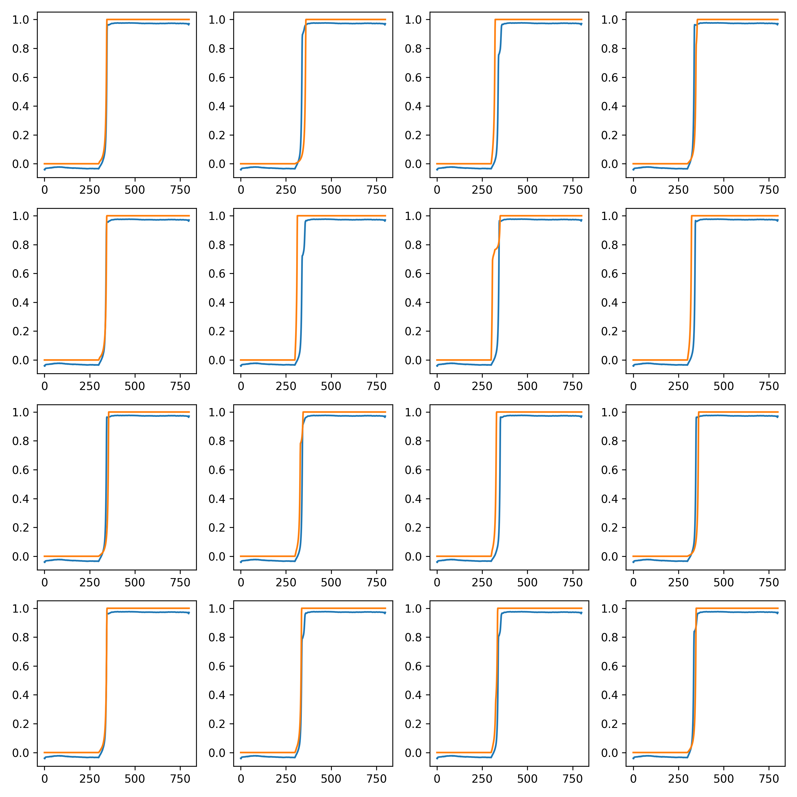
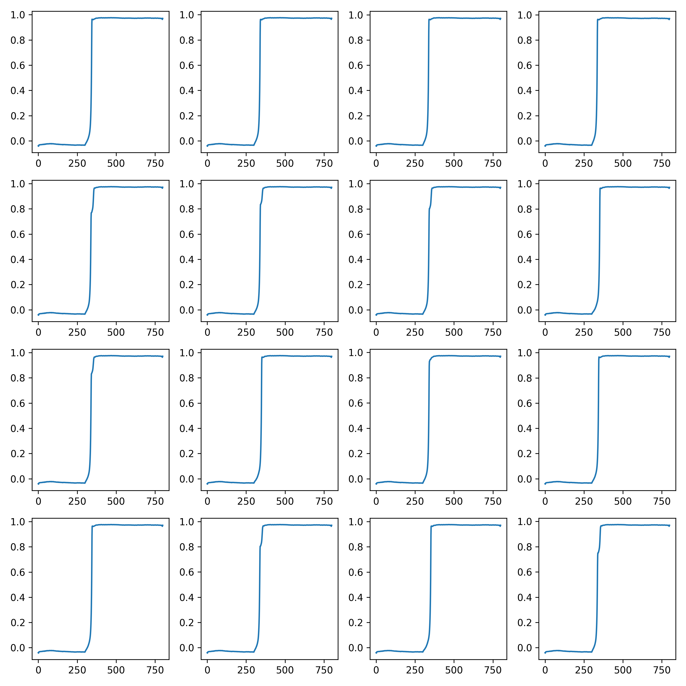

# Diffusion Models (Currently in process):
We have trained a diffusion model to generate a simulated waveform from gaussian noise.
Demonstration:

Predicting Noise

## 1.To view waveform plots of translated waveforms generated by Transformer variation of CPU-net, check out Eugi folder

## 2.To view Diffusion model generated waveform plots, check out:
- generated.png
- generated_from_detector_data.png
- generated_from_noise.png
