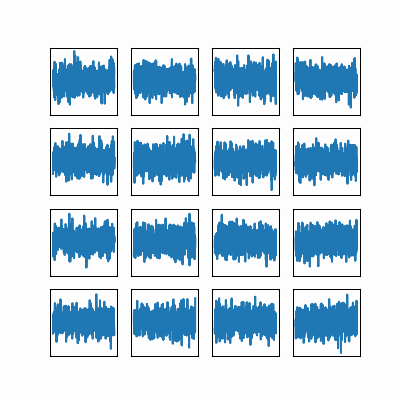
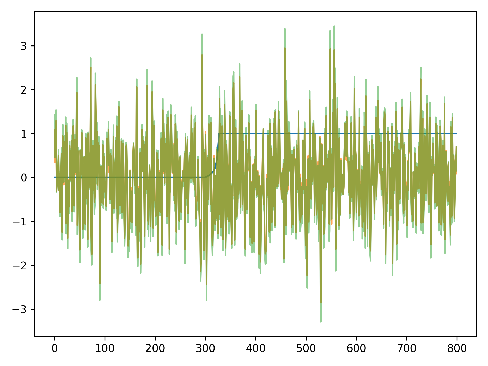
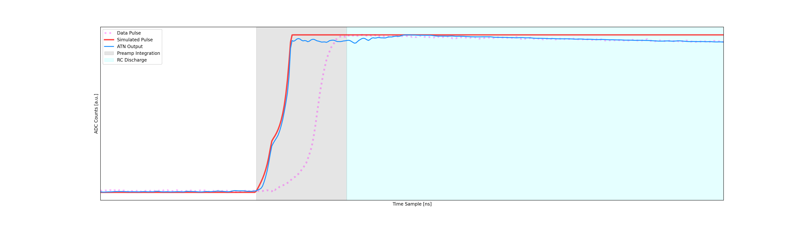
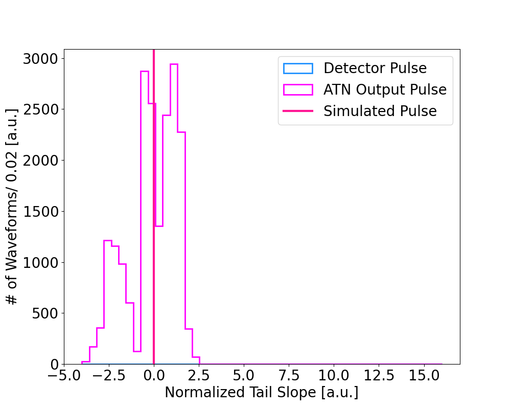

# Diffusion Models (Currently in process):
We have trained a diffusion model to generate a simulated waveform from gaussian noise.
Demonstration:

Predicting Noise

# Transformer + Cycle-GAN Models (Unpaired translation between simulated and detector waveforms)

